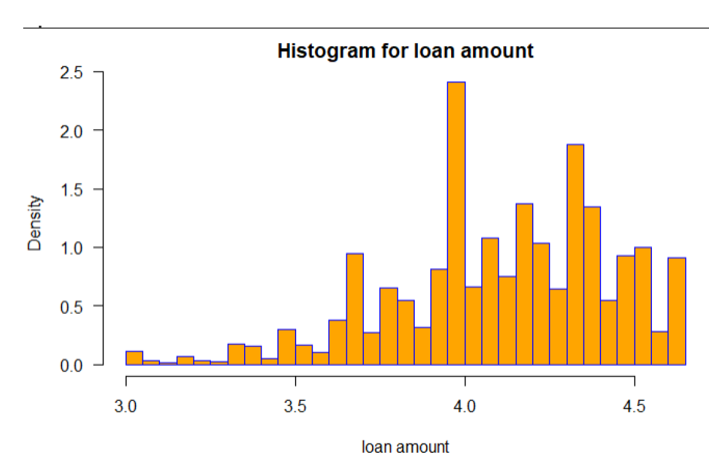
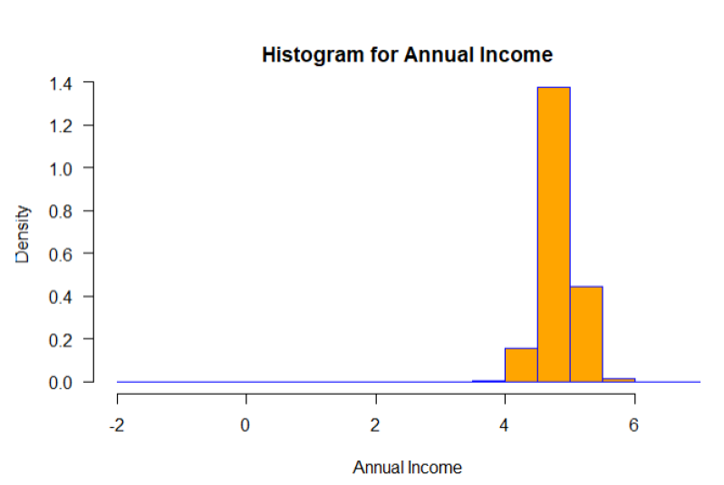
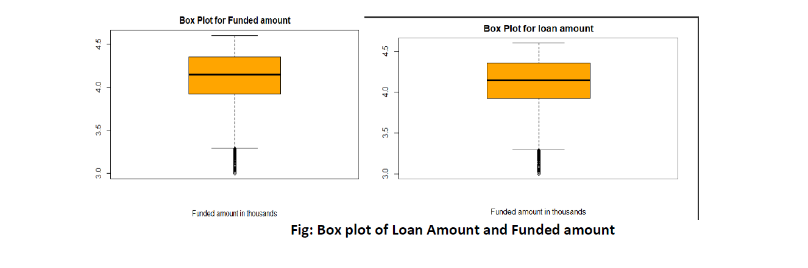
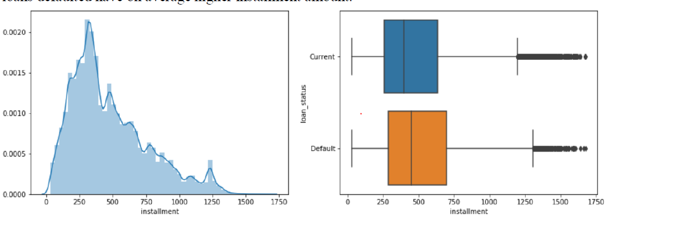

# Predicting-Bank-Loan-Default

### Content 
- [Problem Statement](#Problem-Statement)
- [Data-Overview](#Data-Overview)
- [Project Files](#Project-Files)
- [Data Directory](#Data-Directory)
- [Data Collection and Cleaning](#Data-Collection-and-Cleaning)
- [EDA and Sentiment Analysis](#EDA-and-Sentiment-Analysis)
- [Modeling](#Modeling)
- [References](#References)

## Problem-Statement

The  goal in this analysis (the Analysis or the Project) is thus to predict if a loan remains current or if it will
default given that it has already been originated by a third party bank and purchased by Lending Club indirectly
through its investors. Mathematically, we present the problem statement as:

**Pr(Loan remains current | Loan has been funded)**

The probability that a loan remains current, or alternatively 1 less the probability that the loan defaults is relevant
to both the Company as well as the investors/holders of the notes that funded the purchase the loan. LC can
benefit from better understanding what loans will default once funded and further improve their underwriting
models for future loans, and for investors, the ability to predict if a loan will default or remain current is essential
to understanding their expected return on investment of the loan. For purposes of the Project, we define a loan to
be in default if it is in technical violation of the loan agreement, thus if it has defaulted or if the borrower has
missed a loan payment; we discuss the basis for this grouping further in this report.

## Data-Overview

The datasets from Lending Club are publicly available2. These datasets contain comprehensive information on
all loans purchased by the company between 2007 and Q4 of 2019 (a new updated data set is made available
every quarter). For purposes of the Analysis, I used eight quarters data ranging from 1Q2018 – 4Q2019, as this
represented the most recent loan data. Thus master data set was aggregated across eight separate data files and
compiled into a single dataset. The primary key for the data set is ID. The master data set file contains
1,012,366 tuples with 150 predictors including the response variable. We identified the response variable as
LOAN_STATUS with a cardinality of {Current, Charged Off, Default, Fully Paid, In Grace Period, Late (16-30
Days), Late (31-120 Days}. The dataset is highly dimensional with 149 predictors comprised of a mix of
numeric, categorical and date data types that describe each loan purchased by the Company. Predictor features
of a loan include: loan issue date, interest rate, loan amount, loan terms, next payment date, annual income of
borrower, among others.

### Data Collection and Cleaning

**Response Variable**
For the data set as discussed above, the response variable has been defined as a loan being current or having
defaulted. LOAN_STATUS is the variable indicating loan status. The loan Status variable defines those who are
fully Paid (16.83% ), Current status of the loan (75.8%) and Defaulted (less than 1% of the data) , charged
off(4.5%) of the data. We could the conclude from the data that major portion consists of the Current status of
the loan

**Numerical Predictors:**

One of the important input feature we have explored are LOAN_AMNT which is the loan amount. From the
below plot and Table , we can infer that the loan amount varies between as minimum of 1000$ up to maximum
of 40000. The mean of the loan amount is $16253 and as the box plot suggests, the majority of the loans are
somewhere between $10000 - $20000. It is important to look at how loan amount is distributed among the data.
The distributions of the numerical variables are to be considered for exploration while building the model􀀀􀀀

**Fico Score Vs Loan Status:**

From the box plot we observe that median FICO scores are much higher for current loans compared to defaulted
ones. These FICO scores provide the information on how likely loan status could go Default.
**Installment Vs Loan Status:**
Installment amount varies largely between 261.4 to 693 with median of 450.Based on the plot, we can say that
loans defaulted have on average higher installment amount

