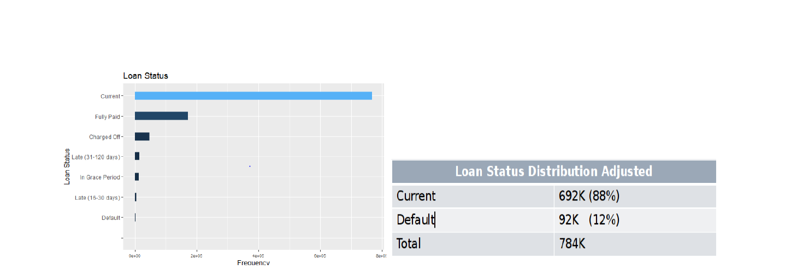

# Predicting-Bank-Loan-Default

### Content 
- [Problem Statement](#Problem-Statement)
- [Data-Overview](#Data-Overview)
- [Project Files](#Project-Files)
- [Data Collection and Cleaning](#Data-Collection-and-Cleaning)
- [Data-Preprocessing-&-Preparation](#Data-Preprocessing-&-Preparation)
- [Market-Basket-Analysis](#Market-Basket-Analysis)
- [Principal-Component-Analysis](#Principal-Component-Analysis)
- [Enhanced-Feature-Engineering](#Enhanced-Feature-Engineering)
- [Modeling](#Modeling)
- [References](#References)

## Problem-Statement

The  goal in this analysis (the Analysis or the Project) is thus to predict if a loan remains current or if it will
default given that it has already been originated by a third party bank and purchased by Lending Club indirectly
through its investors. Mathematically, we present the problem statement as:

**Pr(Loan remains current | Loan has been funded)**
 LC can benefit from better understanding what loans will default once funded and further **improve their underwriting
models for future loans, and for investors, the ability to predict if a loan will default or remain current is essential
to understanding their expected return on investment of the loan.** 

### Data-Overview
The primary key for the data set is ID. The master data set file contains
1,012,366 tuples with **150 predictor**s including the response variable. We identified the response variable as
LOAN_STATUS with a cardinality of {Current, Charged Off, Default, Fully Paid, In Grace Period, Late (16-30
Days), Late (31-120 Days}. 

### Project-Files

[Preprocessing](https://github.com/gauthamikuravi/Predicting-Bank-Loan-Default/tree/master/Preprocessing)

### Data Collection and Cleaning

**Response Variable**
For the data set as discussed above, the response variable has been defined as a loan being current or having
defaulted.**LOAN_STATUS** is the variable indicating loan status. The loan Status variable defines those who are
**fully Paid (16.83% ), Current status of the loan (75.8%) and Defaulted (less than 1% of the data) , charged
off(4.5%) of the data**. We could the conclude from the data that major portion consists of the Current status of
the loan

**Numerical Predictors:**

One of the important input feature we have explored are LOAN_AMNT which is the loan amount. From the
below plot and Table , we can infer that the loan amount varies between as minimum of 1000$ up to maximum
of 40000. The mean of the loan amount is $16253 and as the box plot suggests, the majority of the loans are
somewhere between $10000 - $20000. 
The distributions of the numerical variables are to be considered for exploration while building the model􀀀􀀀

- **Fico Score Vs Loan Status:**

From the box plot we observe that median FICO scores are much higher for current loans compared to defaulted
ones. These FICO scores provide the information on how likely loan status could go Default.
- **Installment Vs Loan Status:**
Installment amount varies largely between 261.4 to 693 with median of 450.Based on the plot, we can say that
loans defaulted have on average higher installment amount

- **Term Length**
There are two categories in Term Length. One with 36 month term the loan was borrowed and other is 60
months. We could see there are higher proportions of those with 36 month term with 693412 and 60 months with

### Data-Preprocessing-&-Preparation

- **Univariate Analysis**
performed univariate analysis on each of the features to check for its variance against the target variable
LOAN_STATUS. Zero-Variance features and the ones having higher percentage of unique values were removed.
- **Multicollinearity**
To understand the relationship between multiple variables and attributes in the dataset i ran correlation matrix
on all the numerical features with threshold as 80% and selected the co-related variable exhibiting maximum
variance to the response.
- **Outlier Analysis**
We performed outlier analysis on all the features that had skewed data distribution.
For identifying outliers Winsorization outlier technique was used. Winsorization replaces extreme values with
the quantiles, rather than removing. This gives an advantage over other techniques which result in loss of
information. Below is the density plot for ANNUAL INCOME feature, from the plot we can see that ANNUAL
INCOME is normally distributed after outlier treatment.

### Market-Basket-Analysis

The purpose of Market Basket Association (MBA) was done as part of Exploratory Data Analysis to ascertain
what features demonstrated higher associations with the response variable in the spirit of parsimonious model
selection. 
The master dataset was prepared for MBA by including only complete data observations and then binning all
numericals into their respective quartile intervals subject to their respective distributions. MBA was then
performed 5x sequentially using the following control parameters:

| Sequence  	| Rule-Minimum 	| Rule-Max 	| Support 	| Confidence 	| Appearance 	| Runtime 	|
|-	|:-:	|-:	|-	|-	|-	|-	|
| 1 	| 2 	| 2 	| 0.01 	| 0.95 	| LOAN_STATUS=”Default” 	| Yes 	|
| 2 	| 2 	| 3 	| 0.01 	| 0.80 	| LOAN_STATUS=”Default” 	| Yes 	|
| 3 	| 2 	| 3 	| 0.01 	| 0.80 	| LOAN_STATUS=”Default” 	| Yes 	|
| 4 	| 2 	| 5 	| 0.01 	| 0.80 	| LOAN_STATUS=”Default” 	| No 	|
| 5 	| 2 	| 5 	| 0.05 	| 0.40 	| LOAN_STATUS=”Default” 	| Yes 	|

### Principal-Component-Analysis
The first 16 principal components are considered relevant with eigenvalues greater than 1.0, and cumulatively
serve to explain approximately 78.9% of the variance in the predictor data set. Examination of the first ф[1,5]
loading vectors indicates that the first 5 eigenvectors (principal components) describe the following features of a
loan:

• PC1: total # credit lines of borrower
• PC2: loan amount and installment of borrower
• PC3: length of time of open credit accounts
• PC4: borrower FICO scores
• PC5: total $ balance on all credit lines of borrower

### Enhanced-Feature-Engineering

**Lasso Regression – Feature Selection**

Following initial model executions, to help gain intuition about which covariates account for most of the
variation in default, I estimated a LASSO regression using all of the available features from preprocessing.
To tune the penalty parameter, we performed 10-fold cross validation with binomial distribution.

LASSO was primarily used for feature selection in conjunction with random forest bagging (variable importance)
to get final set of features. This helped in reducing the dimensionality from 57 to 23 features.

- The waterfall chart below summarizes the total feature selection completed as part of preprocessing and
enhanced feature engineering.
[1] RED denotes subtraction
[2] BLUE denotes addition

### Modelling

Initial models were run on skewed response distribution as further discussed below. Following enhanced engineering and results of the initial model
executions, have  downsampled the current loans to be equal to default loans. For the purpose of modeling, have split the data to 80% under training and 20% under test to validate the model. This method tends to work well and run faster than up sampling or cost-sensitive training. Final dimensions of the train and test data are printed below.
|  	| Rows 	| Columns 	| Encoded-Columns 	|
|-	|-	|-	|-	|
| Train (80%) 	| 116938 	| 37 	| 24 	|
| Test (20%) 	| 29234 	| 37 	| 24 	|

- Thus for purposes of tuning, model parameters, we formulated a new optimization function ROF(Accuracy,Specificity) as defined below:

- **ROF(Accuracy,Specificity) =2*Specificity + Accuracy – (Accmax – Accuracy)**

Determining the likelihood of a loan to default, like many financial metrics, is clearly not an easy task. Our
finding nevertheless shows a promising direction in loan prediction. All 4 prediction models beat the benchmark
strategy of the prior probability of a loan defaulting in the test data set threshold of 50% post down sampling.
XGB performed the best among the 4 models tested with the highest AUC and Accuracy. However, when we
consider the economic cost of the model results, CART/Classification tree is superior to XGB having the highest
Specificity rate among all 4 models. Parsimonious model selection/dimension reduction shows significant
17 improvement in model performance with a 40% increase on average. Reduced feature selection to the subset
exhibiting the strongest predictive relationship with the response optimized our model performance results.

**Model-Summary**

For Lending Club Company, we make the following economic observations to the default likelihood of a loan:
- Last FICO Score and installment amount per income are critical predictors in predicting default
likelihood of a loan
- Joint Applications versus Individual Application loans increased probability of default by 40%
- Debt consolidation loans increased default likelihood by 14% while car financing loans decreased
default likelihood by 18%

### References

Source: Lending Club 10-K, Dec 31, 2019􀀀
􀀀https://www.lendingclub.com/auth/login?login_url=%2Fstatistics%2Fadditional-statistics%3F􀀀
